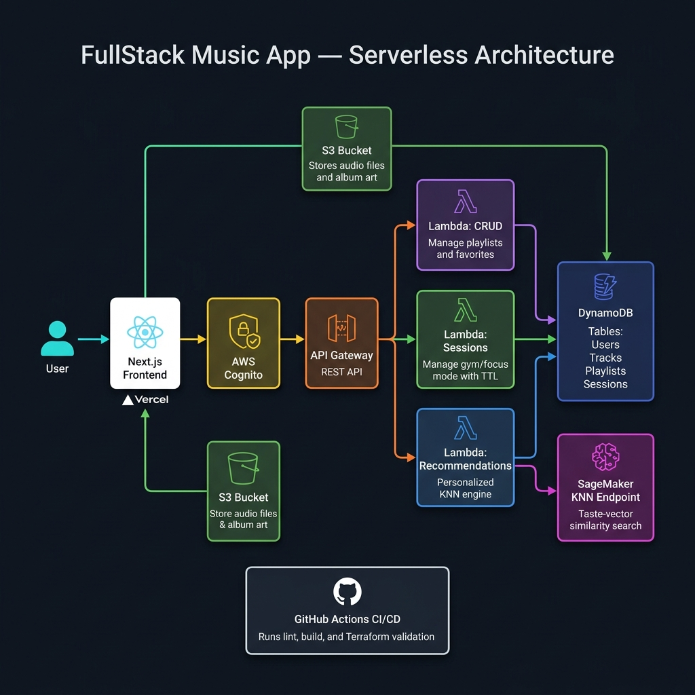
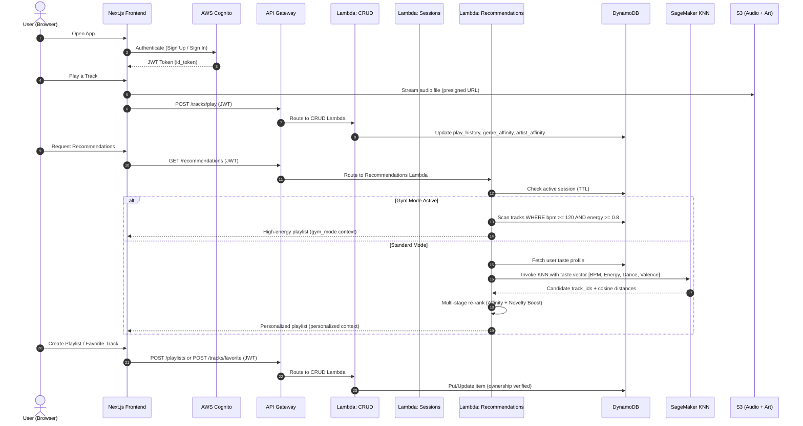

# Serverless Audio Streaming Platform with ML-Powered Recommendations

[](https://nextjs.org/)
[](https://aws.amazon.com/lambda/)
[](https://aws.amazon.com/sagemaker/)
[](https://www.terraform.io/)
[](https://github.com/features/actions)

---

## 📌 Problem Statement & Engineering Justification

Traditional music platforms rely on static playlists and manual curation, failing to adapt to real-time user context (e.g., a gym workout vs. a study session). Building a recommendation engine that is both **context-aware** and **cost-efficient** at scale requires decoupling compute from always-on servers and leveraging managed ML inference.

### The Solution: Serverless + ML-Powered Streaming
This platform solves these challenges with a fully serverless architecture on AWS:
- **Context-Aware Recommendations**: A SageMaker KNN endpoint computes real-time taste vectors from a user's play history (BPM, energy, danceability, valence), then a multi-stage re-ranking algorithm applies genre affinity weighting and a **20% novelty boost** for undiscovered artists.
- **Gym Mode / Focus Sessions**: A DynamoDB session table with TTL auto-expiry switches the recommendation engine to a high-BPM, high-energy filter pipeline — no user intervention needed after activation.
- **Zero Idle Cost**: AWS Lambda functions handle all backend logic (CRUD, sessions, recommendations), scaling to zero when inactive and handling burst traffic elastically.
- **Cognito-Secured API**: Every API Gateway route is authenticated via AWS Cognito JWT tokens, with ownership checks enforced at the Lambda level before any DynamoDB mutation.

---

## 📐 System Architecture & Data Flow

### Infrastructure Overview

<p align="center">
  
</p>

### Request Lifecycle — Step-by-Step



---

## 🛠️ Quickstart & Deployment

### 1. Provision Backend Infrastructure (Terraform)
Deploy DynamoDB tables, Lambda functions, API Gateway, Cognito User Pool, S3 bucket, and IAM roles:
```bash
cd backend/terraform
terraform init
terraform plan
terraform apply -auto-approve
```

### 2. Seed Data & Train ML Model
```bash
# Generate mock track metadata and download sample audio
python scripts/generate_mock_metadata.py
python scripts/download_sample_music.py

# Upload audio assets to S3 and seed DynamoDB
python scripts/upload_assets_and_seed.py

# Train and deploy the SageMaker KNN endpoint
python scripts/sagemaker_knn.py
```

### 3. Run the Frontend (Next.js)
```bash
cd frontend
npm install
npm run dev
# App available at http://localhost:3000
```

### 4. Run Tests
```bash
# Backend unit tests (mocked DynamoDB + SageMaker)
python -m unittest tests/test_backend.py

# Frontend build validation
cd frontend && npm run build
```

---

## ⚡ Key Optimizations & Metrics

### 🧠 Multi-Stage Recommendation Scoring
The recommendation engine goes beyond simple KNN nearest-neighbor retrieval:
```
Score = (CosineSimilarity × 0.5) + (GenreAffinity × 0.3) + (ArtistAffinity × 0.2)
```
- **Novelty Boost**: Candidates from undiscovered artists in target genres receive a **1.2× score multiplier**, promoting fresh content over echo-chamber repetition.
- **Fallback Resilience**: If the SageMaker endpoint is cold-starting or throws an error, the Lambda gracefully degrades to a randomized DynamoDB scan — zero user-facing errors.

### 🏋️ Context-Aware Gym Mode
- Session records use DynamoDB **TTL (Time-To-Live)** with a 1-hour auto-expiry, eliminating the need for cleanup cron jobs.
- Gym Mode filter: `bpm >= 120 AND energy >= 0.8` with genre whitelist (`EDM`, `Metal`, `Gym-Phonk`, `Synthwave`, `Hip-Hop`, `Pop`).

### 📉 Cost & Performance
- **Lambda cold start**: ~200ms (Python 3.11 runtime, minimal dependencies).
- **DynamoDB on-demand pricing**: Zero cost at idle, automatic scaling under load.
- **Play history capped at 20 entries** per user to prevent DynamoDB row bloat and keep taste vector computation under **<50ms**.

### 🔐 Security Model
- **Cognito JWT validation** at API Gateway level — unauthenticated requests are rejected before reaching Lambda.
- **Ownership enforcement**: Every playlist mutation verifies `user_id == claims.sub` before allowing writes, preventing horizontal privilege escalation.
- **CORS restricted** to allowed origins with explicit method/header whitelisting.
